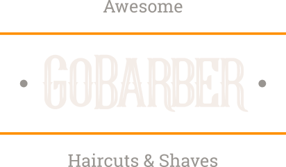

<div align="center">
    
</div>
<h1 align="center">
    
    
</h1>

<h4 align="center">
  🚀 Desafio GoBarber 11.0
</h4>

<p align="center">
  <a href="#-projeto">Projeto</a>&nbsp;&nbsp;&nbsp;|&nbsp;&nbsp;&nbsp;
  <a href="#rocket-tecnologias">Tecnologias</a>&nbsp;&nbsp;&nbsp;|&nbsp;&nbsp;&nbsp;
  <a href="#rocket-executando">Executando</a>&nbsp;&nbsp;&nbsp;|&nbsp;&nbsp;&nbsp;
  <a href="#memo-licença">Licença</a>
</p>
<br>

## 💻 Projeto

Esse projeto foi desenvolvido durante o Bootcamp da Rocketseat. Trata-se de um projeto fullstack para uma barbearia ficticia, a GoBarber, o projeto consiste na parte frontend(React), mobile(React Native) e backend(NodeJs).

## :rocket: Tecnologias

Esse projeto foi desenvolvido com as seguintes tecnologias:

- [Typescript](https://www.typescriptlang.org/)
- [Node.js](https://nodejs.org/en/) | [Express](https://expressjs.com/pt-br/)
- [React](https://reactjs.org/) | [React Native](https://reactnative.dev/)
- [Docker](https://www.docker.com/)
- [PostgreSQL](https://www.postgresql.org/) | [TypeORM](https://typeorm.io/)

## :notebook: Executando

```bash
# Clone este repositório
# Acesse a pasta do projeto no seu terminal/cmd
$ cd rocketseat-gobarber/backend

# Instale as dependências
$ yarn install

# Execute a aplicação
$ yarn start
```

Realizar os comandos acima para as demais pastas **[frontend e backend]**.

## :memo: Licença

Esse projeto está sob a licença MIT. Veja o arquivo [LICENSE](LICENSE.md) para mais detalhes.

---

Feito com horas em frente ao :computer: por [Gabriel Carmo](https://www.linkedin.com/in/gabrielcarmo-s)
 # GoBarber
 
